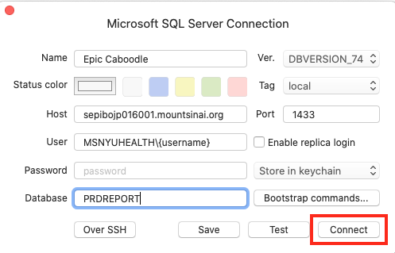

# Connecting to Caboodle

## Connect with TablePlus for Mac

### Before getting started:

###### 1. Download and Install [TablePlus](https://tableplus.com)

[](https://tableplus.com)


###### 2. Watch David Zhang's [Caboodle Video](https://www.youtube.com/watch?v=V7A5DFIeEc8) on YouTube 
  - We'll use a database connector tool, but its useful for additional context. 

### Connecting with TablePlus 

###### 1. VPN into Mount Sinai Health System
  - If you don't have VPN access go here: https://itsecurity.mssm.edu/vpn-instructions/outlook/sailpoint-request/


###### 2. Launch TablePlus Application 


*TablePlus allows you to access Tables and Run Queries.*


###### 3. Click **Create a new connection**.


*We'll need to create a new Connection to use Caboodle.*

###### 4. Select **Microsoft SQL Server**


*The Caboodle Database is on Microsoft SQL Server.*

###### 5. You'll see an empty Microsoft SQL Server Connection window.


*Here is where you'll enter your user access credentials.*

###### 6. **Fill in your credentials**. 

You'll need


*Fill in your credentials in the window.*


Here is the information for the form: 

```
Name: Epic Caboodle
Ver.: DBVERSION_74
Host: sepibojp016001.mountsinai.org
Port: 1433
User: MSNYUHEALTH\{username}
Database: PRDREPORT

```


###### 7.  Click the **Connect** button



*Test or Connect to the Database.*

###### 8. Get a list of the table names

```sql
SELECT
  top 100 *
FROM
  FullAccess.AddressDim

```

## Connect with FreeTDS on Mac

Here's the instructions to set up FreeTDS. I followed this [Install FreeTDS, unixODBC and pyodbc on OS X · GitHub](https://gist.github.com/Bouke/10454272).


###### Homebrew installation

With Homebrew the instructions say to; 

```
brew install unixodbc
```

Then:

```
brew install freetds --with-unixodbc
```

While not in the instructions, I also ran:

```
brew install freetds
```


###### Test `tsql`

Now you should be able to connect using `tsql`:

**Note:** You may need VPN so make sure you are VPN'ed

```
tsql -S sepibojp016001.mountsinai.org -U 'MSNYUHEALTH\{username}' -P '{password}'
```

If you see the following, then you are connected:


Then hit `ctrl + c` to quit. 

###### Link to your Drivers 

Next, in `vim` we'll link to our drivers. So open this file: /`usr/local/etc/odbcinst.ini` with `vim` 

```
vim /usr/local/etc/odbcinst.ini
```

Then paste the following into `vim` editing session:

```
[FreeTDS]
Description = TD Driver (MSSQL)
Driver = /usr/local/lib/libtdsodbc.so
Setup = /usr/local/lib/libtdsodbc.so
FileUsage = 1
```

Hit `esc` and then type `:wq` and hit `enter`. 

Next open this file: `/usr/local/etc/odbc.ini` with `vim` 


```
vim /usr/local/etc/odbc.ini
```

Then paste the following into `vim` editing session:

```
[MYDSN]
Driver = FreeTDS
Server = [IP address]
Port = 1433
```

Hit `esc` and then type `:wq` and hit `enter`. 


## Connect with Python Pandas and pyodbc on Mac

###### First, go through the steps above in the **Connect with FreeTDS on Mac**

###### Install pyodbc

```
pip install pyodbc
```

###### Assuming you have Pandas installed, go ahead and open your terminal, Jupyter Notebook or code editor.


Import Libraries

```python
import pyodbc
import pandas as pd
```

Connect to the database:

**Note:** make sure to change the username and password below and remove the curly brackets `{}` form the string:

```python
cnxn = pyodbc.connect(
    'DRIVER=FreeTDS;SERVER=sepibojp016001.mountsinai.org;PORT=1433;DATABASE=PRDREPORT;UID=MSNYUHEALTH\{username};PWD={password}')
```

Create a SQL query string:

```python
sql = """
SELECT
  top 100  *
FROM
  FullAccess.AddressDim"""
```

Read SQL 

```python
df = pd.read_sql(sql, cnxn)
```

And now you should be able to use the `DataFrame()` object. 


# Caboodle Data Dictionary

https://sepibojp016001/Warehouse/tables/ActivityDim

* The site may not have its SSL Certificate so you have to "Proceed Anyway" or at risk. 
